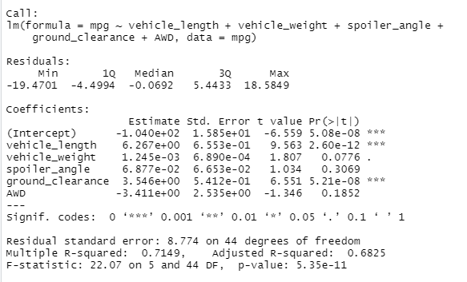
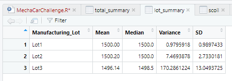
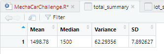
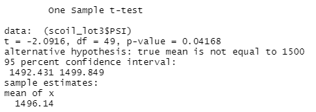

# MechaCar_Statistical_Analysis
module 15 challenge

## Linear Regression to Predict MPG
According to the model results, vehicle length (vehicle_weight) and ground clesrance (ground_clearance) are statistically unlikely to provide a random amount of variance to the linear model. 

The slope of the linear model is not zero - at 0.715 there is correlation between variables.
This model somewhat predicts mpg of prototypes. There are some variables tested that move rnadomly with mpg that can maybe be discarded while other variables could be tested to make the model more robust.

## Summary Statistics on Suspension Coils
The current amnufacturing data meets the 100 psi spec when considering the whole lot. When we drill down into the individual lots however, the data vary. With a variance measure of 170.26 Lot 3 does not comply with that specificiation.

## T-Tests on Suspension Coils
At a 95% confidence interval there is a statistical difference only between the lot 3 sample and the population mean of 1500. In this case, with a p-value of there is enough evidence to reject the null hypothesis and confirm the sample is statistically different from the population.

## Study Design: MechaCar vs Competition
In analyszing sample data for any number of variables between MechaCar to any competitive manufuacturer the null hypothesis asserts that there is no statitical difference within these variable metrics.
In this study design if we were to look at highway fuel efficiency, an alternative hypothesis out of many possible could posit that in vehiclces produced by MechaCar the fuel efficiency advantage is signifigantly above that of the competitor. 
To analyze this single variable across the both sample datasets we would use a two-sample T-test as that test seeks to understand if there are statistical differences in the distribution of data ppints from 2 sources.
We would need fuel efficiency data from the 2 sample datasets in similar continuous units - most likely miles per gallon. Prior to running the analsysi we would need to ensure that the data is normally distriubted and that the sample sizes are reasonably large. 

